# Feature Dependencies
## Talking Tom PWA - Dependency Map & Implementation Sequence

**Generated:** May 1, 2026  
**Source:** User Stories + Acceptance Criteria  
**Status:** [Final]

---

## 1. Dependency Visualization

### 1.1 Foundation Layer (No Dependencies)

These stories have no dependencies and must be implemented first:

```
Foundation Layer
├── US-PERF01: WebGL Detection
├── US-SEC03: Content Security Policy
├── US-PWA05: PWA Manifest Configuration
├── US-V06: Audio Processing Pipeline
├── US-T05: Gesture Detection System
├── US-3D03: Optimized Character Model (asset creation)
└── US-UI01: Loading Screen
```

**Implementation Priority:** Sprint 1, Week 1

---

### 1.2 Core Infrastructure Layer

These depend only on foundation:

```
Core Infrastructure
├── US-3D01: 3D Scene Rendering
│   └── Depends on: US-PERF01 (WebGL Detection)
│
├── US-PWA03: Service Worker Implementation
│   └── Depends on: US-PWA05 (Manifest)
│
├── US-UI07: Responsive Layout
│   └── Depends on: None (Foundation)
│
└── US-PERF04: Asset Optimization
    └── Depends on: US-3D03 (Model), US-PWA03 (Service Worker)
```

**Implementation Priority:** Sprint 1, Week 1-2

---

### 1.3 Dependency Graph (Mermaid)

```mermaid
graph TD
    %% Foundation
    PERF01[US-PERF01: WebGL Detection]
    SEC03[US-SEC03: CSP]
    PWA05[US-PWA05: Manifest]
    V06[US-V06: Audio Pipeline]
    T05[US-T05: Gesture System]
    3D03[US-3D03: Model Asset]
    UI01[US-UI01: Loading Screen]

    %% Core Infrastructure
    3D01[US-3D01: 3D Scene Rendering]
    PWA03[US-PWA03: Service Worker]
    UI07[US-UI07: Responsive Layout]
    PERF04[US-PERF04: Asset Optimization]

    %% 3D Features
    3D02[US-3D02: Model Loading]
    3D04[US-3D04: Lighting]
    3D05[US-3D05: Idle Animation]
    3D06[US-3D06: Animation State Machine]
    3D07[US-3D07: Raycast Detection]
    3D08[US-3D08: Lip Sync]

    %% Voice Features
    V01[US-V01: Listen & Repeat]
    V02[US-V02: Privacy Control]
    V03[US-V03: Pitch Modulation]
    V04[US-V04: Voice Activity Detection]
    V05[US-V05: Browser Fallback]

    %% Touch Features
    T01[US-T01: Poke Reaction]
    T02[US-T02: Pet Character]
    T03[US-T03: Long Press]
    T04[US-T04: Touch Zones]

    %% UI Features
    UI02[US-UI02: Microphone Button]
    UI03[US-UI03: Permission Prompt]
    UI04[US-UI04: Error Messages]
    UI05[US-UI05: Settings Panel]
    UI06[US-UI06: State Indicators]

    %% PWA Features
    PWA01[US-PWA01: Install]
    PWA02[US-PWA02: Offline]
    PWA04[US-PWA04: Offline Indicator]

    %% Performance
    PERF02[US-PERF02: FPS Monitoring]
    PERF03[US-PERF03: 60 FPS Target]
    PERF05[US-PERF05: Fast Load]

    %% Accessibility
    A11Y01[US-A11Y01: WCAG Compliance]
    A11Y02[US-A11Y02: Keyboard Nav]
    A11Y03[US-A11Y03: Screen Reader]
    A11Y04[US-A11Y04: Reduced Motion]
    A11Y05[US-A11Y05: High Contrast]

    %% Security
    SEC01[US-SEC01: Permission Management]
    SEC02[US-SEC02: Local Audio]

    %% Dependencies
    PERF01 --> 3D01
    PWA05 --> PWA03
    3D03 --> 3D02
    UI01 --> 3D02
    3D01 --> 3D02
    3D01 --> 3D04
    3D02 --> 3D05
    3D05 --> 3D06
    3D06 --> V01
    3D06 --> T01
    3D06 --> 3D08
    3D01 --> 3D07
    T05 --> 3D07
    3D07 --> T01
    3D03 --> T04
    T04 --> T01
    T01 --> T02
    T01 --> T03
    T05 --> T02
    T05 --> T03
    V06 --> V01
    V01 --> V02
    V01 --> V03
    V01 --> V04
    V01 --> V05
    V01 --> UI02
    V02 --> UI02
    SEC01 --> UI03
    V02 --> UI03
    V04 --> UI06
    3D06 --> UI06
    V03 --> UI05
    PWA03 --> PWA01
    PWA03 --> PWA02
    PWA02 --> PWA04
    3D01 --> PERF02
    3D06 --> PERF03
    PERF04 --> PERF03
    PERF04 --> PERF05
    PWA03 --> PERF05
    V06 --> SEC02
    V01 --> 3D08
    3D03 --> PERF04
    PWA03 --> PERF04
    UI07 --> A11Y01
    UI02 --> A11Y02
    UI05 --> A11Y02
    UI02 --> A11Y03
    3D06 --> A11Y04
    UI05 --> A11Y04

    classDef foundation fill:#e1f5ff,stroke:#01579b
    classDef core fill:#fff9c4,stroke:#f57f17
    classDef feature fill:#c8e6c9,stroke:#2e7d32
    classDef polish fill:#f8bbd0,stroke:#c2185b

    class PERF01,SEC03,PWA05,V06,T05,3D03,UI01 foundation
    class 3D01,PWA03,UI07,PERF04 core
    class 3D02,3D04,3D05,3D06,3D07,V01,V02,T01,T02,T04,UI02,UI03,PWA01,PWA02 feature
    class 3D08,V03,V04,V05,T03,UI04,UI05,UI06,PWA04,PERF02,PERF03,PERF05,A11Y01,A11Y02,A11Y03,A11Y04,A11Y05,SEC01,SEC02 polish
```



---

## 2. Detailed Dependency Tables

### 2.1 Voice Interaction Dependencies

| Story | ID | Depends On | Blocks | Implementation Order |
|-------|-----|-----------|--------|---------------------|
| **Audio Processing Pipeline** | US-V06 | None (Foundation) | V01, V02, V03, V04, V05, SEC02 | 1 |
| **Listen and Repeat** | US-V01 | US-V06, US-3D06 | V02, V03, V04, V05, UI02, 3D08 | 7 |
| **Voice Privacy Control** | US-V02 | US-V01 | UI02, UI03 | 8 |
| **Pitch Modulation** | US-V03 | US-V01, US-UI05 | - | 14 |
| **Voice Activity Detection** | US-V04 | US-V01 | UI06 | 14 |
| **Browser Compatibility Fallback** | US-V05 | US-V01 | - | 15 |

**Critical Path:** US-V06 → US-V01 → US-V02 → US-UI02

**Rationale:**
- US-V06 must be first (core audio infrastructure)
- US-V01 depends on animation state machine (US-3D06) for character reactions
- US-V02, V03, V04, V05 are enhancements on top of US-V01
- US-V03 additionally needs settings panel (US-UI05)

---

### 2.2 Touch Interaction Dependencies

| Story | ID | Depends On | Blocks | Implementation Order |
|-------|-----|-----------|--------|---------------------|
| **Gesture Detection System** | US-T05 | None (Foundation) | T01, T02, T03, 3D07 | 1 |
| **Touch Zone Definition** | US-T04 | US-3D03 | T01, T02, T03 | 4 |
| **Raycast Touch Detection** | US-3D07 | US-3D01, US-T05 | T01, T02, T03 | 6 |
| **Poke Reaction** | US-T01 | US-3D07, US-T04, US-3D06 | T02, T03 | 8 |
| **Pet the Character** | US-T02 | US-T01, US-T05 | - | 9 |
| **Long Press Interaction** | US-T03 | US-T01, US-T05 | - | 10 |

**Critical Path:** US-T05 → US-3D07 → US-T01 → US-T02

**Rationale:**
- US-T05 (gesture system) is foundation, no dependencies
- US-3D07 (raycast) needs 3D scene (US-3D01) and gesture system (US-T05)
- US-T04 (touch zones) needs character model (US-3D03) loaded
- US-T01 (poke) needs raycast, zones, and animation state machine
- US-T02 and US-T03 are variations on US-T01

---

### 2.3 3D Character & Animation Dependencies

| Story | ID | Depends On | Blocks | Implementation Order |
|-------|-----|-----------|--------|---------------------|
| **Optimized Character Model** | US-3D03 | None (Asset creation) | 3D02, T04, PERF04 | 1 |
| **3D Scene Rendering** | US-3D01 | US-PERF01 | 3D02, 3D04, 3D07, PERF02 | 2 |
| **Character Model Loading** | US-3D02 | US-3D01, US-3D03, US-UI01 | 3D05, 3D06 | 3 |
| **Scene Lighting** | US-3D04 | US-3D01 | - | 4 |
| **Idle Animation** | US-3D05 | US-3D02 | 3D06 | 5 |
| **Animation State Machine** | US-3D06 | US-3D05 | V01, T01, T02, T03, 3D08, UI06, PERF03, A11Y04 | 6 |
| **Raycast Touch Detection** | US-3D07 | US-3D01, US-T05 | T01, T02, T03 | 6 |
| **Lip Sync Animation** | US-3D08 | US-3D06, US-V01 | - | 15 |

**Critical Path:** US-3D03 → US-3D01 → US-3D02 → US-3D05 → US-3D06 → (V01, T01)

**Rationale:**
- US-3D03 (model asset) must exist before loading (asset pipeline)
- US-3D01 (scene) needs WebGL detection (US-PERF01)
- US-3D02 (loading) needs scene + model + loading UI
- US-3D05 (idle) needs model loaded and rendering
- US-3D06 (state machine) is critical blocker for ALL interactions (voice + touch)
- US-3D07 (raycast) and US-3D06 can be developed in parallel
- US-3D08 (lip sync) is polish feature, depends on voice + animation

---

### 2.4 PWA Capabilities Dependencies

| Story | ID | Depends On | Blocks | Implementation Order |
|-------|-----|-----------|--------|---------------------|
| **PWA Manifest Configuration** | US-PWA05 | None (Foundation) | PWA03, PWA01 | 1 |
| **Service Worker Implementation** | US-PWA03 | US-PWA05 | PWA01, PWA02, PERF04, PERF05 | 2 |
| **Install to Home Screen** | US-PWA01 | US-PWA03 | - | 10 |
| **Offline Functionality** | US-PWA02 | US-PWA03 | PWA04 | 11 |
| **Offline Indicator** | US-PWA04 | US-PWA02 | - | 12 |

**Critical Path:** US-PWA05 → US-PWA03 → PWA02

**Rationale:**
- US-PWA05 (manifest.json) is simple config, no dependencies
- US-PWA03 (service worker) is critical for PWA, needs manifest
- US-PWA01 (install) needs working service worker for PWA criteria
- US-PWA02 (offline) tests that cached assets work offline
- US-PWA04 (indicator) is UI polish on top of offline

---

### 2.5 UI/UX Component Dependencies

| Story | ID | Depends On | Blocks | Implementation Order |
|-------|-----|-----------|--------|---------------------|
| **Loading Screen** | US-UI01 | None (Foundation) | 3D02 | 1 |
| **Responsive Layout** | US-UI07 | None (Foundation) | A11Y01 | 1 |
| **Microphone Button** | US-UI02 | US-V01, US-V02 | A11Y02, A11Y03 | 9 |
| **Permission Prompt** | US-UI03 | US-SEC01, US-V02 | - | 9 |
| **Error Messages** | US-UI04 | None (Can implement anytime) | - | 13 |
| **Visual State Indicators** | US-UI06 | US-V04, US-3D06 | - | 14 |
| **Settings Panel** | US-UI05 | US-V03 | A11Y02, A11Y04 | 14 |

**Critical Path:** US-UI01 (early), US-UI02 (after voice), US-UI05 (after pitch)

**Rationale:**
- US-UI01 (loading screen) needed for US-3D02 (model loading)
- US-UI07 (responsive) is foundational CSS, no blockers
- US-UI02 (mic button) needs voice features (US-V01, V02) to function
- US-UI03 (permission prompt) needs permission logic (US-SEC01)
- US-UI04 (error messages) can be implemented incrementally
- US-UI05 (settings) needs voice pitch (US-V03) to be meaningful
- US-UI06 (state indicators) needs voice activity + animation states

---

### 2.6 Performance & Optimization Dependencies

| Story | ID | Depends On | Blocks | Implementation Order |
|-------|-----|-----------|--------|---------------------|
| **WebGL Detection** | US-PERF01 | None (Foundation) | 3D01 | 1 |
| **Asset Optimization** | US-PERF04 | US-3D03, US-PWA03 | PERF03, PERF05 | 3 |
| **Frame Rate Monitoring** | US-PERF02 | US-3D01 | - | 13 |
| **Target 60 FPS** | US-PERF03 | US-3D06, US-PERF04 | - | 16 |
| **Fast Initial Load** | US-PERF05 | US-PERF04, US-PWA03 | - | 16 |

**Critical Path:** US-PERF01 → US-3D01 → ... → US-PERF04 → US-PERF03, US-PERF05

**Rationale:**
- US-PERF01 (WebGL detection) must be first (blocks 3D)
- US-PERF04 (asset optimization) depends on having assets (3D03) and service worker (PWA03)
- US-PERF02 (FPS monitor) is a dev tool, can be added anytime after 3D rendering
- US-PERF03 and US-PERF05 are final optimization goals, tested at end

---

### 2.7 Accessibility Dependencies

| Story | ID | Depends On | Blocks | Implementation Order |
|-------|-----|-----------|--------|---------------------|
| **WCAG 2.1 AA Compliance** | US-A11Y01 | All UI components | - | 17 (Continuous) |
| **Keyboard Navigation** | US-A11Y02 | US-UI02, US-UI05 | - | 17 |
| **Screen Reader Support** | US-A11Y03 | US-UI02 | - | 17 |
| **Reduced Motion Support** | US-A11Y04 | US-3D06, US-UI05 | - | 17 |
| **High Contrast Mode** | US-A11Y05 | All UI components | - | 18 (Optional) |

**Critical Path:** All accessibility stories depend on UI components being implemented first

**Rationale:**
- Accessibility is continuous work alongside feature development
- US-A11Y01 (WCAG compliance) requires all UI to exist
- US-A11Y02 (keyboard nav) needs interactive elements (UI02, UI05)
- US-A11Y03 (screen reader) needs labels on buttons (UI02)
- US-A11Y04 (reduced motion) needs animations (3D06) and settings (UI05)
- US-A11Y05 (high contrast) is medium priority, can be last

---

### 2.8 Security & Privacy Dependencies

| Story | ID | Depends On | Blocks | Implementation Order |
|-------|-----|-----------|--------|---------------------|
| **Content Security Policy** | US-SEC03 | None (Foundation) | - | 1 |
| **Permission Management** | US-SEC01 | US-V02 | UI03 | 8 |
| **Local Audio Processing** | US-SEC02 | US-V06 | - | 7 |

**Critical Path:** US-SEC03 (early), US-SEC02 (with voice), US-SEC01 (with privacy control)

**Rationale:**
- US-SEC03 (CSP) should be configured early in deployment setup
- US-SEC02 (local audio) is validated during US-V06 (audio pipeline) implementation
- US-SEC01 (permission management) builds on US-V02 (privacy control)

---

## 3. Implementation Sequence by Sprint

### Sprint 1: Foundation & Core Rendering (Weeks 1-2)

**Week 1: Foundation Setup**
1. US-PERF01: WebGL Detection
2. US-SEC03: Content Security Policy (deployment config)
3. US-PWA05: PWA Manifest Configuration
4. US-3D03: Optimized Character Model (asset creation parallel track)
5. US-UI01: Loading Screen
6. US-UI07: Responsive Layout
7. US-T05: Gesture Detection System (foundation)
8. US-V06: Audio Processing Pipeline (foundation)

**Week 2: 3D Rendering**
9. US-3D01: 3D Scene Rendering
10. US-PWA03: Service Worker Implementation
11. US-PERF04: Asset Optimization
12. US-3D02: Character Model Loading
13. US-3D04: Scene Lighting
14. US-3D05: Idle Animation

**Sprint 1 Deliverable:** Character renders and idles on screen, PWA installable (offline caching works)

---

### Sprint 2: Core Interactions (Weeks 3-4)

**Week 3: Animation & Touch**
15. US-3D06: Animation State Machine ⚠️ **Critical Path**
16. US-3D07: Raycast Touch Detection (parallel with 3D06)
17. US-T04: Touch Zone Definition
18. US-T01: Poke Reaction

**Week 4: Voice System**
19. US-V01: Listen and Repeat ⚠️ **Critical Path**
20. US-V02: Voice Privacy Control
21. US-SEC01: Permission Management
22. US-SEC02: Local Audio Processing (validate with V01)
23. US-T02: Pet the Character
24. US-T03: Long Press Interaction
25. US-UI02: Microphone Button
26. US-UI03: Permission Prompt

**Sprint 2 Deliverable:** Voice input/output working, touch interactions (poke, pet, hold) functional

---

### Sprint 3: Polish & Enhancement (Weeks 5-6)

**Week 5: UI Polish**
27. US-PWA01: Install to Home Screen
28. US-PWA02: Offline Functionality (validate)
29. US-PWA04: Offline Indicator
30. US-UI04: Error Messages
31. US-PERF02: Frame Rate Monitoring (dev tool)
32. US-V03: Pitch Modulation
33. US-V04: Voice Activity Detection
34. US-UI05: Settings Panel
35. US-UI06: Visual State Indicators

**Week 6: Advanced Features**
36. US-V05: Browser Compatibility Fallback
37. US-3D08: Lip Sync Animation
38. US-PERF03: Target 60 FPS (optimization pass)
39. US-PERF05: Fast Initial Load (optimization pass)

**Sprint 3 Deliverable:** Full feature set, settings panel, performance optimized

---

### Sprint 4: Accessibility & Testing (Weeks 7-8)

**Week 7: Accessibility**
40. US-A11Y01: WCAG 2.1 AA Compliance (audit and fix)
41. US-A11Y02: Keyboard Navigation
42. US-A11Y03: Screen Reader Support
43. US-A11Y04: Reduced Motion Support

**Week 8: Final Testing & Bug Fixes**
44. US-A11Y05: High Contrast Mode (optional)
45. Bug fixes from testing
46. Performance optimization
47. Device matrix testing
48. E2E test suite completion
49. Documentation finalization

**Sprint 4 Deliverable:** Fully accessible, tested, production-ready PWA

---

## 4. Parallel Development Opportunities

### 4.1 Workstreams That Can Run in Parallel

**Workstream 1: 3D Foundation (Developer A)**
- US-3D01 → US-3D02 → US-3D04 → US-3D05 → US-3D06

**Workstream 2: Audio Foundation (Developer B)**
- US-V06 → (wait for US-3D06) → US-V01 → US-V02

**Workstream 3: PWA Infrastructure (Developer C)**
- US-PWA05 → US-PWA03 → US-PERF04 → US-PWA01 → US-PWA02

**Workstream 4: UI Components (Designer + Developer D)**
- US-UI01 → US-UI07 → US-UI02 → US-UI03 → US-UI05

**Workstream 5: Touch Gestures (Developer E)**
- US-T05 → (wait for US-3D01) → US-3D07 → US-T04 → US-T01 → US-T02 → US-T03

**Sync Points:**
- **Week 2 End:** US-3D06 complete (blocks voice and touch interactions)
- **Week 3 End:** US-V01 and US-T01 complete (core interactions done)
- **Week 6 End:** All features complete (start accessibility)

---

### 4.2 Asset Creation Parallel Track

**3D Asset Pipeline (External or dedicated artist):**
1. Week 1: Character modeling (< 20k triangles)
2. Week 1: UV unwrapping, texture baking (1024x1024)
3. Week 2: Rigging (< 50 bones)
4. Week 2: Animation creation (idle, listening, speaking, reactions)
5. Week 3: Export to .glb with Draco compression (< 5MB)
6. Week 4: Integration testing and optimization

**Sound Design Pipeline (External or dedicated sound designer):**
1. Week 1: Collect/create sound effects (giggle, purr, surprise, boing)
2. Week 2: Audio editing, normalization, compression (MP3 128kbps)
3. Week 3: Integration testing
4. Week 4: Final mixing and optimization (< 500KB total)

---

## 5. Critical Path Analysis

### 5.1 Longest Critical Path

**Duration:** ~6 weeks for core features

```
US-PERF01 (1 day)
  ↓
US-3D01 (2 days)
  ↓
US-3D02 (3 days, includes US-3D03 asset dependency)
  ↓
US-3D05 (3 days)
  ↓
US-3D06 (5 days) ⚠️ CRITICAL BOTTLENECK
  ↓
US-V01 (4 days, parallel with US-T01)
  ↓
US-V02 (2 days)
  ↓
US-UI02 (2 days)
  ↓
[Additional features...]
```

**Total Critical Path Duration:** ~22 days (4.4 weeks) for MVP

**Bottleneck:** US-3D06 (Animation State Machine) - 5 days
- Blocks: ALL voice interactions, ALL touch interactions
- Risk Mitigation: Start early (Week 3), assign experienced developer, write tests first

---

### 5.2 Critical Dependencies Diagram (Simplified)

```
Foundation (Week 1)
  ├── WebGL Detection → 3D Scene Rendering (Week 2)
  │                        ↓
  │                    Character Loading (Week 2)
  │                        ↓
  │                    Animation State Machine (Week 3) ⚠️ BLOCKER
  │                        ↙         ↘
  │                Voice Features     Touch Features (Week 4)
  │                  (Week 4)           ↓
  │                     ↓            Touch Interactions
  │               Voice Interactions
  │
  ├── Audio Pipeline → Voice Repeat (Week 4) → Voice Enhancements (Week 5)
  │
  └── Service Worker → Offline (Week 5) → PWA Install (Week 5)
```

---

## 6. Risk Dependencies

### 6.1 High-Risk Dependencies

| Story | Risk | Mitigation |
|-------|------|------------|
| **US-3D06** | Animation State Machine is complex, blocks all interactions | Start early (Week 3), dedicated developer, TDD approach, pair programming |
| **US-V06** | Audio pipeline may have browser compatibility issues | Prototype early (Week 1), test on all target browsers, have fallback plan |
| **US-PWA03** | Service worker bugs can break entire app | Extensive testing, incremental rollout, cache versioning strategy |
| **US-3D02** | Model loading may be slow, frustrate users | Progressive loading, skeleton screens, optimize model size |
| **US-PERF04** | Asset optimization may not meet targets | Start optimization early, use compression tools (Draco, WebP), monitor bundle size |

---

### 6.2 Dependency Assumptions

**Assumption 1:** 3D character model will be ready by Week 3
- **Dependency:** US-3D02, US-3D05, US-3D06 all need model
- **Mitigation:** Use placeholder model in Week 1-2, swap in final model Week 3

**Assumption 2:** Audio pipeline will work on target browsers
- **Dependency:** US-V01, US-V02, US-V03, US-V04 all need audio
- **Mitigation:** Test Web Audio API early (Week 1), have browser compatibility matrix

**Assumption 3:** Single developer can implement US-3D06 in 5 days
- **Dependency:** Blocks voice + touch features (10+ stories)
- **Mitigation:** If Week 3 shows delays, add second developer, reduce scope of state machine

---

## 7. Integration Points

### 7.1 Major Integration Points

**Integration Point 1: Animation State Machine + Voice (Week 4)**
- **Stories:** US-3D06 + US-V01
- **Challenge:** Voice playback must trigger SPEAKING animation state
- **Test:** Integration test: record voice → verify SPEAKING animation plays → verify IDLE return

**Integration Point 2: Animation State Machine + Touch (Week 4)**
- **Stories:** US-3D06 + US-T01
- **Challenge:** Raycast detection → gesture recognition → state transition → animation
- **Test:** E2E test: tap head → verify poke animation → verify IDLE return

**Integration Point 3: Service Worker + Asset Loading (Week 5)**
- **Stories:** US-PWA03 + US-3D02
- **Challenge:** Ensure .glb model cached correctly for offline
- **Test:** Load online → go offline → reload → verify model loads from cache

**Integration Point 4: Settings Panel + Voice Pitch (Week 5)**
- **Stories:** US-UI05 + US-V03
- **Challenge:** Settings UI must trigger audio pipeline re-initialization
- **Test:** Change pitch slider → record voice → verify pitch changed

**Integration Point 5: Accessibility + All UI (Week 7)**
- **Stories:** US-A11Y02 + US-UI02, US-UI05, etc.
- **Challenge:** Ensure all interactive elements keyboard accessible
- **Test:** Keyboard-only navigation test, screen reader test

---

## 8. Feature Flags & Incremental Rollout

### 8.1 Optional Feature Flags

**Use feature flags for high-risk features:**

| Feature | Flag Name | Default | Rollout Strategy |
|---------|-----------|---------|------------------|
| **Lip Sync Animation** | `ENABLE_LIP_SYNC` | false | Enable after voice + animation stable (Week 6) |
| **Voice Activity Detection** | `ENABLE_VAD` | true | Can disable if performance issues |
| **Shadows** | `ENABLE_SHADOWS` | false | Enable on high-end devices only |
| **High Contrast Mode** | `ENABLE_HIGH_CONTRAST` | false | Enable after A11Y testing (Week 8) |
| **FPS Monitoring** | `ENABLE_FPS_DEBUG` | false | Developer mode only |

**Implementation:**
```typescript
// constants/featureFlags.ts
export const FEATURE_FLAGS = {
  ENABLE_LIP_SYNC: import.meta.env.MODE === 'production' ? false : true,
  ENABLE_VAD: true,
  ENABLE_SHADOWS: false, // Detect device capability
  ENABLE_HIGH_CONTRAST: false,
  ENABLE_FPS_DEBUG: import.meta.env.MODE === 'development'
};
```

---

## 9. Testing Dependencies

### 9.1 Test Implementation Sequence

**Unit Tests (Continuous):**
- Write alongside feature implementation
- US-V06 → audio utils tests
- US-T05 → gesture detection tests
- US-3D06 → state machine tests

**Integration Tests (After Core Features):**
- Week 4: Voice pipeline integration test (US-V01)
- Week 4: Touch interaction integration test (US-T01)
- Week 5: Offline functionality test (US-PWA02)

**E2E Tests (After Feature Complete):**
- Week 6: All critical user journeys
- Week 7: Accessibility E2E tests
- Week 8: Device matrix testing

---

## 10. Summary & Recommendations

### 10.1 Critical Path Summary

**Shortest Path to MVP:**
1. Week 1: Foundation (WebGL, Audio Pipeline, Gesture System, UI, PWA Manifest)
2. Week 2: 3D Rendering + Character Loading + Service Worker
3. Week 3: **Animation State Machine** (CRITICAL BLOCKER)
4. Week 4: Voice + Touch Interactions (parallel development possible)
5. Week 5: UI Polish + Settings + PWA Features
6. Week 6: Performance Optimization
7. Week 7-8: Accessibility + Testing + Bug Fixes

**Total Duration:** 8 weeks (as planned)

---

### 10.2 Recommended Development Sequence

**Phase 1 (Weeks 1-2): Foundation - NO BLOCKERS**
- US-PERF01, US-SEC03, US-PWA05, US-3D03, US-UI01, US-UI07, US-T05, US-V06, US-3D01, US-PWA03, US-PERF04, US-3D02, US-3D04, US-3D05

**Phase 2 (Weeks 3-4): Core Interactions - AFTER 3D06**
- US-3D06 ⚠️ START IMMEDIATELY WEEK 3
- US-3D07, US-T04, US-T01, US-T02, US-T03 (touch track)
- US-V01, US-V02, US-SEC01, US-SEC02 (voice track)
- US-UI02, US-UI03 (UI track)

**Phase 3 (Weeks 5-6): Enhancement & Optimization - POLISH**
- US-PWA01, US-PWA02, US-PWA04, US-UI04, US-PERF02, US-V03, US-V04, US-UI05, US-UI06, US-V05, US-3D08, US-PERF03, US-PERF05

**Phase 4 (Weeks 7-8): Accessibility & Launch - QUALITY GATES**
- US-A11Y01, US-A11Y02, US-A11Y03, US-A11Y04, US-A11Y05
- Testing, Bug Fixes, Documentation

---

### 10.3 Key Recommendations

1. **Start US-3D06 (Animation State Machine) immediately in Week 3** - it blocks 15+ stories
2. **Parallelize voice and touch development in Week 4** - they both depend on US-3D06 but not each other
3. **Use placeholder assets in Week 1-2** - don't wait for final 3D model
4. **Test audio pipeline early (Week 1)** - cross-browser compatibility issues are common
5. **Implement service worker incrementally** - start with basic caching, enhance over time
6. **Build accessibility in from the start** - don't save for Week 7, add ARIA labels as you go
7. **Use feature flags for risky features** - lip sync, shadows, VAD can be toggled off

---

**Document Status:** [Final]  
**Dependency Mapping Complete:** ✅ Yes  
**Critical Path Identified:** ✅ Yes (US-3D06 is bottleneck)  
**Parallel Development Planned:** ✅ Yes (5 workstreams)  
**Risk Mitigation Documented:** ✅ Yes  
**Ready for Architecture Phase:** ✅ Yes  
**Next Agent:** Architect (Architecture Decision Record + Schema Design)
